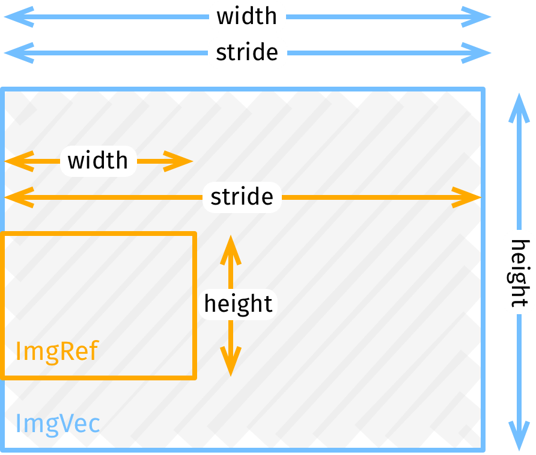

# 2D slice of a an image

This is a minimal struct that represents a 2-dimensional vector and rectangular slices of it. It's intended for describing image data, and regions of images (AKA bitmap descriptors, frames with a pitch or stride, planes). It's useful when working with image data, and can be used as the common struct for exchanging image pixels between crates.

* [API Reference](https://docs.rs/imgref)
* [Installation](https://crates.io/crates/imgref)

In graphics code it's very common to pass `width` and `height` along with a `Vec` or a slice of pixels — all as separate arguments. This gets very repetitive, and can lead to errors.

Additionally, some graphics code requires use of `stride`, which allows defining sub-regions of images without copying. This is useful for slicing and tiling, and to support bitmaps that require padding (e.g. in video formats that round frame sizes to a multiple of a block size).

This crate is a simple struct that adds dimensions to the underlying pixel buffer. This makes it easier to correctly keep track of the image size and allows passing images with just one function argument instead three or four. For convenience, it also implements efficient iterators for pixels/rows and indexing with `img[(x,y)]`.

```rust
use imgref::*;

fn main() {
    let img = Img::new(vec![0; 1000], 50, 20); // 1000 pixels of a 50×20 image

    let new_image = some_image_processing_function(img.as_ref()); // Use imgvec.as_ref() instead of &imgvec for better efficiency

    println!("New size is {}×{}", new_image.width(), new_image.height());
    println!("And the top left pixel is {:?}", new_image[(0u32,0u32)]);

    let first_row_slice = &new_image[0];

    for row in new_image.rows() {
        …
    }
    for px in new_image.pixels() {
        …
    }

    // slice (x, y, width, height) by reference - no copy!
    let fragment = img.sub_image(5, 5, 15, 15);

    // create a vec of pixels without stride, for compatibility with software
    // that expects pixels without any "gaps"
    let (vec, width, height) = fragment.to_contiguous_buf();
}
```

## Type aliases



These are described in [more detail in the reference](https://docs.rs/imgref).

### `ImgVec`

It owns its pixels (held in a `Vec`). It's analogous to a 2-dimensional `Vec`. Use this type to create and return new images from functions.

Don't use `&ImgVec`. Instead call `ImgVec.as_ref()` to get a reference (`ImgRef`) from it (explicit `.as_ref()` call is required, because Rust doesn't support [custom conversions](https://github.com/rust-lang/rfcs/pull/1524) yet.)

### `ImgRef`

`ImgRef` is a reference to pixels owned by some other `ImgVec` or a slice. It's analogous to a 2-dimensional `&[]`.

Use this type to accept read-only images as arguments in functions. Note that `ImgRef` is a `Copy` type. Pass `ImgRef`, and *not* `&ImgRef`.

### Requirements

* Latest stable Rust (1.42+)
